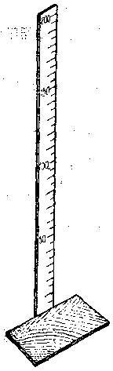
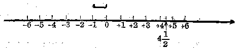

数轴
----

我们在量身高的时候，通常可用一根直立的木尺，划上许多横格，并注明一些表示长度的数字(一般用厘米作为单位长度).当一个人站到下面的垫板上时，他的足底刚刚对准这根尺的起点，从他的头顶所对的尺上的位置，可以读出他的身高的厘米数.这就是说，对于每一个身体高度的厘米数，这根木尺上有一个和它对应的位置.

我们容易想到，是不是对于所有的有理数，正的、负的和零，也可以有类似这样的尺，使每一个有理数都能在尺上找到它对应的位置呢？

有的.事实上温度计就是这样一根尺.在温度计上，我们既有对应于正的度数的点，也有对应于零度的点，并且还有对应于负的度数的点.

用同祥的方法，我们可以用一条直线上的点来表示全部有理数.

现在说明如下：

任意画一条水平方向的直线，规定它的一个方向是正的，和它相反的方向是负的(通常规定向右的方向是正的，向左的方向是负的)，画一个箭头表示它的正方向，如图1.3所示.

如同木尺上的起点和温度计上的零度点一样，我们在这条直线上任意取一点0，表示有理数零，这一点叫做**原点**.如同木尺上的厘米长度和温度计上的一度的格子一样，我们可以任意指定一个单位长度，画在这条直线的旁边.然后在直线上，从原点0开始，依照这个单位长度，向右一次一次地截过去，顺次得到对应于正整数的各点的位置+1，+2，+3，+4，$\ldots$；再从原点0开始，依照这个单位长度，向左一次一次地截过去，顺次得到对应于负整数的各点的位置，-1，-2，-3，-4，$\ldots$如果我们要表示分数的位置，那末只要从原点0向右依照单位长度截取4次，再截取相当于单位长度的一半，得到的点就表示有理数了.用同样的方法，我们可以在这条直线上找出表示任意有理数的点.这种用来表示数的直线叫做**数轴**.

从上面所讲，我们可以看出：

**数轴是一条用来表示数的直线，它要有规定的正方向，原点和单位程度.**

从图上可以看出，所有表示正数的点都在原点的右边，所有表示负数的点都在原点的左边.原点本身就表示既不是正数也不是负数的数0.

数轴上表示某个数的点叫做这个数的对应点.所有不相等的数都有不同的对应点.

<h5>习题</h5>

1.  画出一条数轴.标出它的原点，正方向和单位长度.在这条数轴上指出下列各数的对应点：
    
    +3，0，$1\cfrac{1}{2}$，$-2\cfrac{1}{3}$.

2.  数轴上原点右面的点表示的是什么数？左面的点呢？

3.  数轴上会不会有两个不同的点表示同样的数？

4.  数轴上会不会有一个点表示两个不同的数？

5.  画出一条数轴，在数轴上作出下列各个数的对应点：
    
    +5，-5，+1，-1，$+2\cfrac{1}{2}$，$-2\cfrac{1}{2}$，0，$-\cfrac{1}{3}$，$-1\cfrac{1}{3}$.
    
    从图上各点的左右位置，把这9个数依照对应点的位置，从左到右排列起来.

6.  从上面这个题目的各点的位置看看：+5与-5的两个对应点与原点的距离一样吗？这两点的位置有什么不同？+1与-1呢？$+2\cfrac{1}{2}$与$-2\cfrac{1}{2}$呢？

