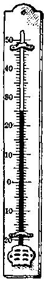
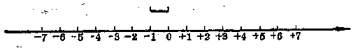

有理数大小的比较
----------------

----

在算术里，我们已经知道数可以比较大小.现在我们把数扩充到有理数，是不是所有的有理数也都能够比较大小呢？

我们不妨仍旧从温度计上来研究.零上5°与零下5°是不是相等的温度呢？如果不相等，那末哪一个温度高呢？零上5°与零下6°哪一个温度高呢？零下2°与零下1°哪一个温度高呢？零度与零下1°哪一个温度高呢？从温度计上可以看出：零上5°与零下5°的温度是不相等的，零上5°高于零下5°零上5°也高于零下6°零下2°则低于零下1°，零度也高于零下1°.

如果把零上的度数用正数来表示，零下的度数用负数来表示，那末上面的结果就是：

+5°>-50，+5°>-6°，

-2°<-10，0°>-1°.

同样，我们也可以从它们在数轴上的对应点的位置来确定有理数的大小：

**有理数大小的规定**：\CJKunderanysymbol{0.4em}{.}{在水平数轴上表示的两个有理数，如果把向右方向作为正方向，那么，在右边的一个数总比在左边的一个数大.}

例如：+5>-5；+5>-6；-1>-2；0>-1.

从数轴上的左右关系，我们又可以清楚地看出：

<h5>有理数大小的比较法则</h5>
<ol>
<li>
任何正数，大于任何负数；
</li>
<li>
任何正数，大于零；
</li>
<li>
任何负数，小于零；
</li>
<li>
两个正数中，绝对值大的那个数较大；
</li>
<li>
两个负数中，绝对值大的那个数较小.
</li>
</ol>

----

[ **例** ] 比较3.56与-8.39的大小.

[ **解** ] 3.56是正数，-8.39$是负数，  

$\because\quad$任何正数大于任何负数，  

$\therefore\quad$3.66>-8.39.

<h5>备注</h5>

记号“$\because$”读做“因为”，“$\therefore$”读做“所以”.

----

[ **例** ] 比较0与-7.8的大小.

[ **解** ] 因为任何负数小于零，  
$\therefore \quad$-7.8<0.

----

[ **例** ] 比较-3.56与-4.07的大小.

[ **审题** ] -3.56与-4.07都是负数，先看它们的绝对值.

[ **解** ] \|-3.56\|=3.56，\|-4.07\|=4.07，  
4.07>3.56，  
$\therefore\quad$\|-4.07\|>\|-3.56\|.  
$\because\quad$绝对值大的负数较小，  
$\therefore\quad$-4.07<-3.56.

----

[ **例** ] 比较$-\cfrac{2}{3}$与$-\cfrac{3}{4}$的大小.

[ **解** ] $\Big\|-\cfrac{2}{3}\Big\|=\cfrac{2}{3}$，$\Big\|-\cfrac{3}{4}\Big\|=\cfrac{3}{4}$  
$\because\quad\cfrac{2}{3}<\cfrac{3}{4}$， $\therefore\quad-\cfrac{2}{3}>-\cfrac{3}{4}$.

----

[ **例** ] 比较下列三个数的大小：+3，-5，-1.

[ **解** ] 在这三个数中，+3最大，-1又比-5大，  
$\therefore\quad$+3>-1>-5.

[ **注意** ] 三个数同时比较大小时，书写的次序必须使两个不等号都是“大于号”或者都是“小于号”.所以这一题也可以写做-5<-1<+3.但下列写法是错误的：-5<3>-1，因为这样就看不出-5与-1之间的大小了.

<h5>习题</h5>

1.  写出四个大于0的整数；写出四个小于0的整数.

2.  写出所有小于7的正整数；写出所有大于-5的负整数.

3.  写出所有大于-3而小于+4的整数，并在数轴上把它们表示出来.这些数里面，有几对相反的数？

4.  比较下列各组数的大小，用关系符号连接起来：

    (1)  7，10；

    (2)  $+6\cfrac{2}{3}$，$+6\cfrac{3}{4}$；

    (3)  7，-3；

    (4)  -3，-8；

    (5)  $-3\cfrac{1}{3}$，$-3\cfrac{1}{4}$；

    (6)  0，-7.

    [解法举例：(1) 7<10.]

5.  比较下列各组数的大小，用关系符号“>”连接起来：

    (1)  3.7，$+3\cfrac{5}{8}$；

    (2)  -3，0；

    (3)  165，-200；

    (4)  $-\cfrac{12}{7}$，$-1\cfrac{3}{4}$；

    (5)  3.1，-3.1；

    (6)  -3.1，-3.2.

6.  比较下列各组数的大小：

    (1)  0，$-\cfrac{1}{2}$，$-\cfrac{1}{3}$ (用关系符号$<$连接起来)；

    (2)  $1\cfrac{2}{3}$，$1\cfrac{3}{4}$，$-3\cfrac{1}{4}$ (用关系符号$>$连接起来).

7.  比较下列各题中两个数的大小：

    (1)  \|+5\|，\|-6\|；

    (2)  \|+5\|，\|-7\|；

    (3)  \|-7\|，\|-2\|；

    (4)  -\|+5\|，-\|-7\|；

    (5)  -(-6)，-\|-6\|.

8.  写出绝对值大于4的三个正数和三个负数；写出绝对值小于3的三个正数和三个负数.

9.  写出绝对值等于2的一个正数和一个负数.

10. 在数轴上指出绝射值等于5的数，这样的数有几个？

11. 写出绝对值小于4的所有整数，这样的数里有几组是相反的数？

12. 写出绝对值大于4而小于8的所有整数.

