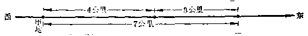
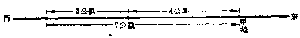
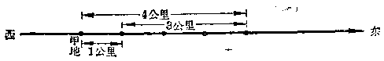
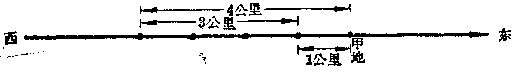

有理数的加法
------------

----

在算术里我们学过整数、分数和小数的加法、减法、乘法和除法.应用这四种运算，可以解决许多实际问题.现在我们已经学习了有理数，要应用它来解决更多的实际问题，就需要学会怎样进行有理数的运算.

这一节里，我们先来研究有理数的加法.让我们来看下面的一些问题.

----

### 符号相同的两个有理数相加

[ **问题** ] 在一条东西方向的公路上，一个人从甲地出发先向**东**走4公里，以后又向**东**走3公里.结果这个人离开甲地几公里？它的位置在甲地的哪一边？

[ **解** ] 从下面的图上可以看出，这个人现在在甲地东边7公里.

从算术里我们已经知道，这个问题可以用加法来算，但是为了在算式里能够把方向也表示出来，我们取向东的方向作为正方向，那末只要把向东4公里记做+4公里，向东3公里记做+3公里，东边7公里记做+7公里，这个题目的解答就可以列成算式：

(+4)+(+3)=+7.

答:在甲地东边7公里.

[ **问题** ] 如果在上题中，这个人先向**西**走4公里，再向**西**走3公里，结果这个人离开甲地几公里？在甲地的哪一边？  
从下图可以看出，他现在在甲地西边7公里.

我们仍旧把向东的方向作为正方向，那末向西4公里记做-4公里，向西3公里记做-3公里，西边7公里记做-7公里.因为这个题目的性质和问题1是相同的(只是走的方向不同)，仍旧应该用加法来算.这样就要把这个人走了两次以后离开原地的公里数和方向用

(-4)+(-3)

来表示，并且得到算式

(-4)+(-3)=-7.

答:在甲地西边7公里.

从上面两个问题的解答中，我们看到：两个正数相加，它们的和还是一个正数，和的绝对值就是这两个加数的绝对值的和；两个负数相加，它们的和仍旧是个负数，和的绝对值是这两个加数的绝对值的和.

----

### 符号相反的两个有理数相加

[ **问题** ] 在问题1中，如果这个人先向**东**走4公里，后来又向**西**走3公里，那末结果他离开甲地几公里？在甲地哪一边？

[ **解** ] 从下图中可以看出他应该在甲地东边1公里.

我们仍旧把向东的方向作为正方向，那末向东4公里记做+4公里，向西3公里记做-3公里，东边1公里记做+1公里.

因为这个题目的性质还是和问题1相同的(只是两次走的方向不同)，我们仍旧可以用加法来做.这样就要把他最后离开原地的公里数和方向，用

(+4)+(-3)

来表示，并且得到算式

(+4)+(-3)=+1.

答:在东边1公里.

[ **问题** ] 如果这个人先向**西**走4公里，再向**东**3公里，结果他离开甲地几公里？在甲地哪一边？

[ **解** ] 从下图可以看出，他在甲地西边1公里.

我们仍旧把向东的方向作为正方向，那末向西4公里只要记做-4公里，向东3公里只要记做+3公里，西边1公里只要记做-1公里.

这个问题的性质还是和问题1相同，所以我们仍旧用加法.把这个人最后离甲地的公里数和方向用

(-4)+(+3)

来表示，并且得到算式

(-4)+(+3)=-1.

答:在西边1公里.

[ **问题** ] 如果这个人先向**东**走4公里，再向**西**走4公里，结果他离甲地几公里？在哪一边？

[ **解** ] 很明显，他仍在原地.就是离开原地0公里.  
象上面的问题3和问题4一样，我们可以用

(+4)+(-4)

来表示他最后离开原地的公里数和方向，并且得到算式

(+4)+(-4)=0.

从上面的三个问题的解答中可以看到，符号相反的两个数相加，它们的和的符号与加数里绝对值大的这个数的符号相同，和的绝对值应该等于加数的绝对值的差；如果这两个数是相反的数，那末和就是0.

----

### 关于零的加法

在算术里，我们已经知道一个数和零相加，结果仍旧等于这个数.例如

3+0=3，0+3=3，0+0=0.

对于加数中有负数的时候，这个性质还是一样的.例如

(-4)+0=-4，0+(-4)=-4.

读者可以自己用上面的问题来解释这两个式子的实际意义.

----

### 有理数加法法则

把上面这些情况归纳起来，我们就可以得到：

<h5>有理数的加法法则</h5>
<ol>
<li>
正负符号相同的两个数的和.它的符号与这两个数的符号相同，它的绝对值等于这两个数的绝对值的和.
</li>
<li>
正负符号相反的两个数的和，它的符号与绝对值较大的加数的符号相同，它的绝对值等于这两个数的绝对值的差(特殊情况：两个相反的数的和等于零).
</li>
<li>
任零同任何一个数的和就等于这个数(特殊情况：零加零等于零).
</li>
</ol>

----

[ **例** ] 计算：  

(1) (+15)+(+24)；  

(2) (+5.36)-(+2.73)；  
  
(3) (-16)+(-31)；  
  
(4) $\Big(-2\cfrac{1}{3}\Big)+\Big(-5\cfrac{1}{2}\Big)$.

[ **解** ]

(1) (+15)+(+24)=+39；  

(2) (+5.36)-(+2.73)=+8.09；  
  
(3) (-16)+(-31)=-47；  
  
(4) $\Big(-2\cfrac{1}{3}\Big)+\Big(-5\cfrac{1}{2}\Big)=-\Big(2\cfrac{1}{3}+5\cfrac{1}{2}\Big)=-7\cfrac{5}{6}$.

[ **注意** ]

(1) 这里都是两个符号相同的数的加法，只要把它们的绝对值相加，再写上相同的性质符号就是了.  

(2) 正数的性质符号可以省略.如(+15)+(+24)=+39，可以写成15+24=39.

----

[ **例** ] 计算下列加法：  

(1) (+3.5)+(-7.2)；  

(2) (+364)+(-120)；  
  
(3) $\Big(-3\cfrac{2}{3}\Big)+\Big(+2\cfrac{1}{2}\Big)$；  
  
(4) (-5.74)+(+6.74).

[ **解** ] 

(1) (+3.5)+(-7.2)=-3.7；  

(2) (+364)+(-120)=+244；  
  
(3) $\Big(-3\cfrac{2}{3}\Big)+\Big(+2\cfrac{1}{2}\Big)=-1\cfrac{1}{6}$；  
  
(4) (-5.74)+(+5.74)=0.

[ **注意** ]

(1) 这里都是两个符号不同的数的加法，要把它们的绝对值相减，求出绝对值的差，再写上绝对值较大的那个加数的符号.  

(2) 正数的性质符号可以省略.例如(+3.5)+(-7.2)可以写成3.5+(-7.2)； $\Big(-3\cfrac{2}{3}\Big)+\Big(+2\cfrac{1}{2}\Big)$可以写成$\Big(-3\cfrac{2}{3}\Big)+2\cfrac{1}{2}$或者写成$-3\cfrac{2}{3}+2\cfrac{1}{2}$.

----

[ **例** ] 计算：

(1) (+245)+0；

(2) $0+(-3\cfrac{1}{3})$；

(3) 0+(+5.32)；

(4) 0+0.

[ **解** ]

(1) (+245)+0=+245；  

(2) $0+\Big(-3\cfrac{1}{3}\Big)=-3\cfrac{1}{3}$；  

(3) 0+3.32=3.32；  

(4) 0+0=0.

----

[ **例** ] 计算：  

(1) (+15)+(-16)+(-8)+(+9)；  

(2) $\Big(-3\cfrac{3}{5}\Big)+(-2.7)+(+5.4)+\Big(-7\cfrac{1}{5}\Big)$.

[ **解** ] 依从左到右顺次计算：  

(1) (+15)+(-16)+(-8)+(+9)  

=(-1)+(-8)+(+9)  
  
=(-9)+(+9)=0.  
  
(2) $\Big(-3\cfrac{3}{5}\Big)+(-2.7)+(+5.4)+\Big(-7\cfrac{1}{5}\Big)$  
  
=(-3.6)+(-2.7)+(+5.4)-(-7.2)  
  
=(-6.3)+(+5.4)+(-7.2)  
  
=(-0.9)+(-7.2)=-8.1.

<h5>习题</h5>

1.  回答下列问题：在算术里，两个数的和会小于任意一个加数吗？在代数里呢？举一个例子.

2.  做下列加法：

    (1)  (+172)+(+283)；

    (2)  (-31)+(-72)；

    (3)  (-103)+(-207)；

    (4)  (+15)+(-11)；

    (5)  (+284)+(-316)；

    (6)  (-72)+(+28)；

    (7)  (-123)+(+319)；

    (8)  $\Big(+\cfrac{1}{2}\Big)+\Big(+\cfrac{2}{3}\Big)$；

    (9)  $\Big(-\cfrac{1}{3}\Big)+\Big(-\cfrac{1}{6}\Big)$；

    (10) $\Big(-3\cfrac{1}{3}\Big)+\Big(-5\cfrac{3}{5}\Big)$；

    (11) $\Big(+8\cfrac{1}{3}\Big)+\Big(-4\cfrac{2}{3}\Big)$；

    (12) $\Big(+5\cfrac{1}{4}\Big)+\Big(-7\cfrac{1}{3}\Big)$；

    (13) $\Big(-16\cfrac{5}{12}\Big)+\Big(+12\cfrac{7}{12}\Big)$；

    (14) $\Big(-3\cfrac{1}{7}\Big)+\Big(+5\cfrac{1}{5}\Big)$；

    (15) (+8.63)+(+0.7)；

    (16) (-12.43)+(-34.507)；

    (17) (+8.63)+(-6.234)；

    (18) (-32.8)+(+51.76)；

    (19) $\Big(+3\cfrac{1}{3}\Big)+(+0.3)$；

    (20) $\Big(-5\cfrac{2}{3}\Big)+(-2.71)$.

3.  计算：

    (1)  (+3)+(+5)+(-7)+(-4)+(-3)+(+6)；

    (2)  (+12)+(-18)+(-23)+(+51)+(-7)+(+4)；

    (3)  (-35)+(-6)+(-7)+(+8)+(+9)+(+14)+(+17)；

    (4)  $\Big(+6\cfrac{1}{4}\Big)+\Big(-6\cfrac{1}{4}\Big)+(-3.3)+(+3.3)+(+6)+(-6)$.

