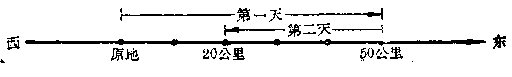
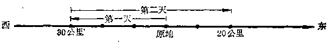

加法的运算性质
--------------

----

### 加法交换律

让我们先看一个问题：一个人在一条东西向的公路上第一天向东行50公里，第二天向西行30公里，他所到达的地方，与第一天先向西行30公里；而后在第二天再向东行50公里所到达的地方，结果是否相同？

如果我们把向东的方向作为正方向，那末：

在第一种情况下

得算式 (+50)+(-30)=+20；

在第二种情况下

得算式 (-30)+(+50)=+20.

两种情况的结果是相同的，他所到达的地方都是在原地东边20公里.可见

(+50)+(-30)=(-30)+(+50).

同样地，

(-3.64)+(-6.27)=-9.81，(-6.27)+(-3.54)=-9.81

$\therefore\quad$(-3.54)+(-6.27)=(-6.27)+(-3.54).

在算术里，我们曾经学过： _加法中的两个加数，交换它们的位置，它们的和不变_ ，这叫做**加法交换律**.这个性质对于有理数的加法，也是适用的.我们可以用字母表示如下：

<h5>加法交换律</h5>

a+b=b+a

这里a和b表示任意两个有理数.

----

### 加法结合律

让我们再看：

(1) (3+5)+7=8+7=15，

3+(5+7)=3+12=16，

$\therefore \quad $(3+5)+7=3+(5+7)；

(2) [(-3)(+5)]+(-12)=(+2)+(-12)=-10，

(-3)+[(+5)+(-12)]=(-3)+(-7)=-10，

$\therefore \quad $[(-3)+(+5)]+(-12)  
  
=(-3)+[(+5)+(-12)]

这样的性质，在加法里，对于任意三个加数都是成立的.这种性质叫做**加法结合律**，那就是： _如果有三个加数，先把前面的两个加数相加，再加上第三个加数，与先把后面两个加数相加，再和第一个加数相加，结果相同._ 我们可以用字母表示如下：

<h5>加法结合律</h5>

(a+b)+c=a+(b+c)

这里a，b，c表示任意三个有理数.

----

[ **例** ] 计算：3764+2985+6286.

[ **解1** ] 依照从左到右的次序演算：  

: 3764+2985+6236=6749+6236

  =12985.

[ **解2** ] 应用加法交换律交换第二个与第三个加数的位置：  

: 3764+2985+6236=3764+6236+2985  

  =10000+2985=12985.  
  
显然，第二种解法因为凑成了一个比较整齐的数10000，就比第一种解法简便些.

----

[ **例** ] 计算：  

$\Big(+6\cfrac{3}{5}\Big)+\Big(-5\cfrac{2}{3}\Big)+\Big(+4\cfrac{2}{5}\Big)+\Big(+2\cfrac{1}{7}\Big)
+\Big(-1\cfrac{1}{3}\Big)+\Big(-1\cfrac{1}{7}\Big)$.

[ **解** ] 应用加法交换律和加法结合律，把分母相同的数先合并起来：  

$\Big(+6\cfrac{3}{5}\Big)+\Big(-5\cfrac{2}{3}\Big)+\Big(+4\cfrac{2}{5}\Big)+\Big(+2\cfrac{1}{7}\Big)
+\Big(-1\cfrac{1}{3}\Big)+\Big(-1\cfrac{1}{7}\Big)$  

$=\Big(+6\cfrac{3}{5}\Big)+\Big(+4\cfrac{2}{5}\Big)+\Big(-5\cfrac{2}{3}\Big)+\Big(-1\cfrac{1}{3}\Big) 
+\Big(+2\cfrac{1}{7}\Big)+\Big(-1\cfrac{1}{7}\Big)$

$=\Big[\Big(+6\cfrac{3}{5}\Big)+\Big(+4\cfrac{2}{5}\Big)\Big]+\Big[\Big(-5\cfrac{2}{3}\Big)+\Big(-1\cfrac{1}{3}\Big)\Big]
+\Big[\Big(+2\cfrac{1}{7}\Big)+\Big(-1\cfrac{1}{7}\Big)\Big]$  

$=(+11)+(-7)+(+1)=(+4)+(+1)=5$.

----

[ **例** ] 计算：

(+32)+(-18)+(+164)+(-32)+(-164).

[ **解** ] 应用加法交换律与加法结合律，先把相反的数合并成零：  

(+32)+(-18)+(+164)+(-32)+(-164)
  
=(+32)+(-32)+(-18)+(+164)+(-164)

=0+(-18)+0=-18.

----

[ **例** ] 计算：  

(+32)+(-17)+(+167)+(-243)+(+24)+(-7).

[ **解** ] 应用加法交换律和加法结合律，先把符号相同的数合并起来：  

(+32)+(-17)+(+157)+(-243)+(+24)+(-7)

=(+32)+(+157)+(+24)+(-17)+(-243)+(-7)  
  
=(+213)+(-267)=-54.

从上面这些例子可以看出，做有理数加法的时候，在下列情况下，一般可以应用加法交换律和加法结合律，使计算变得简便：

(1) 有些加数相加后可以得到比较整齐的整数时，可先行相加；

(2) 分母相同或易于通分的分数，可以先行相加；

(3) 有相反的数可以互相消去得零的，可以先行相加；

(4) 许多正数和许多负数相加时，可以先把符号相同的数相加，即正数与正数相加，负数与负数相加，最后再把一个正数与一个负数相加.

<h5>习题</h5>

应用加法交换律、结合律，选取最合理的方法进行计算：

1.  (+132)+(-124)+(-16)+0+(-132)+(+16).

2.  (+127)+(+13)+(-300)+(-140)+(-189)+(+300).

3.  (+127)+(-373)+(+233)+(-125)+(-12)+(+540).

4.  (+6)+(-12)+(+8.3)+(-7.4)+(+9.1)+(-2.5).

5.  $\Big(+3\cfrac{5}{6}\Big)+\Big(+5\cfrac{1}{7}\Big)+\Big(-2\cfrac{1}{6}\Big)+\Big(+32\cfrac{6}{7}\Big)$.

6.  $\Big(+7\cfrac{3}{4}\Big)+\Big(-5\cfrac{4}{11}\Big)+\Big(-3\cfrac{1}{4}\Big)+\Big(-6\cfrac{5}{11}\Big)+\Big(+17\cfrac{1}{4}\Big)+\Big(+1\cfrac{1}{4}\Big)$.

7.  (+3.543)+(-0.543)+(+6.457)+(-0.417).

8.  $\Big(+3\cfrac{2}{5}\Big)+\Big(-2\cfrac{7}{8}\Big)+\Big(-3\cfrac{5}{12}\Big)+\Big(+5\cfrac{3}{5}\Big)+\Big(-1\cfrac{1}{8}\Big)+\Big(+5\cfrac{5}{12}\Big)$.

