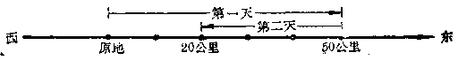

有理数的乘法
------------

----

### 两个有理数的乘法

我们来看下面的问题：

[ **问题** ] 一列火车在东西方向的铁路上行驶，速度是每小时40公里.如果中午的时候恰巧经过甲车站.问在与中午相距3小时的时候，它离开甲车站多少公里？

[ **解** ] 我们知道，这个问题可以用乘法来解决，就是

${速度}\times{时间}={路程}$.

$$40\times3=120 \qquad \qquad(1)$$

答:离开甲车站120公里.

在这个问题里，没有指出火车究竟是向哪一个方向行驶，也没有指出这个时间究竟是在中午以前还是中午以后，所以我们计算出来的结果，也只能知道火车离开甲车站的公里数，而还不知道火车究竟在甲车站的东边还是西边.

如果要确切地知道火车在所问的时间究竟在哪里，那末就需要知道火车行驶的方向，是向东还是向西，所问的时间是在中午以前还是在中午以后.在这种情况下，我们就需要用有理数的乘法来解决这个问题.

我们规定从西到东的方向作为正方向.那末火车从西到东行驶的速度就可以用正数来表示，从东到西行驶的速度，用负数来表示.

例如：

每小时向东行驶40公里，记做每小时+40公里，

每小时向西行驶40公里，记做每小时-40公里.

火车在甲车站东边时，这段路程可以用正数来表示，在西边时，这段路程就用负数来表示.

例如：

在东边120公里，记做+120公里，

在西边120公里，记做-120公里.

对于时间来说，我们也可以作这样的规定，以中午时间为标准，午后的时间用正数来表示，午前的时间用负数来表示.

例如：

午前3小时，记做-3小时，

午后3小时，记做+3小时.

现在，我们来研究问题1里的各种可能情况：

[ **问题** ] 火车以每小时40公里的速度**从西向东**行驶，中午经过甲车站，问**午后**3小时，火车在甲车站的哪一边？离开甲车站几公里？

[ **解** ] 从下面的图可以看到，这时火车应该在甲车站的东边120公里(就是离开甲车站+120公里).

这里速度是每小时+40公里，时间是+3小时.

$\therefore\quad{速度}\times{时间}$是$(+40)\times(+3)$公里

这段路程是+120公里.

我们得到算式：

$$(+40)\times(+3)=+120 \qquad \qquad (2)$$

答:在甲车站东边120公里.

[ **问题** ]  火车以每小时40公里的速度，**从东向西**行驶，中午经过甲车站.问**午后**3小时，火车在甲车站的哪一边？离开甲车站几公里？  

从下图可以看到，这时火车应该在甲车站的西边120公里(就是离开甲车站-120公里).

这里速度是每小时-40公里，时间是+3小时.

速度$\times$时间是$(-40)\times(+3)$公里.

这段路程是-120公里.

我们得到算式：

$$(-40)\times(+3)=-120 \qquad \qquad (3)$$

答:火车在甲车站西边120公里.

[ **问题** ] 火车以每小时40公里的速度，**从西向东**，中午经过甲车站.问**午前**3小时，火车在甲车站的哪一边？离开甲车站几公里？

[ **解** ] 从下图可以看到，为了要火车在中午到达甲车站，午前3小时的时候火车应该在甲车站西边120公里(就是离开甲车站-120公里).

这里速度是每小时+40公里，时间是-3小时.

速度$\times$时间是$(+40)\times(-3)$公里.

这段路裎就是-120公里.

我们得到算式：

$$(+40)\times(-3)=-120 \qquad \qquad (4)$$

答:火车在甲车站西边120公里.

[ **问题** ] 火车以每小时40公里的速度，**从东向西**行驶，中午经过甲车站.问**午前**3小时，火车在甲车站哪一边？离开甲车站几公里？

[ **解** ] 从下图可以看到，为了要火车在中午到达甲车站，在午前3小时的时候，火车应该在甲车站东边120公里(就是离开甲车站+120公里).

这里速度是每小时-40公里，时间是-3小时.

速度$\times$时间是$(-40)\times(-3)$公里.

这段路程是+120公里.

我们得到算式：

$$(-40)\times(-3)=+120 \qquad \qquad$$

答:火车在甲车站东边120公里.

从上面问题2~5的解答中，可以发现一个重要的事实.在(2)和(5)里，我们做的是两个符号相同的有理数的乘法，我们看到：

符号相同的两个有理数相乘，它们的积应该是一个正数，积的绝对值就是两个因数的绝对值的积.

在(3)和(4)里，我们做的是符号相反的两个有理数的乘法，我们看到：

符号相反的两个有理数相乘，它们的积应该是一个负数，积的绝对值等于两个因数的绝对值的积.

很明显的，在上面的问题里，如果速度和时间中有一个是零，或者两个都是零，那末火车仍旧在甲车站.也就是说，火车离开甲车站的距离是零.这就说明了：

任何一个有理数和零相乘，积是零.

例如：

$(+40)\times0=0$，$0\times(+3)=0$，

$(-40)\times0=0$，$0\times(-3)=0$，

$0\times0=0$.

把上面这些情况综合起来，我们得到：

<h5>有理数的乘法法则</h5>
<ol>
<li>
正负符号相同的两个数的积是一个正数，它的绝对值等于这两个数的绝对值的积；
</li>
<li>
正负符号相反的两个数的积是一个负数，它的绝对值等于这两个数的绝对值的积；
</li>
<li>
零同任何一个数的积总等于零.
</li>
</ol>

为了便于记忆，我们把上面(1)、(2)两条法则，概括起来，得到决定积的符号的口诀：**同号相乘得正数，异号相乘得负数**.用字母表示如下：

<h5>有理数乘法的符号法则</h5>

(+a)(+b) = +ab. (-a)(+b) = -ab.

(-a)(-b) = +ab. (+a)(-b) = -ab.
  

这里a，b表示任意两个正有理数.

----

[ **例** ] 计算：

: (1)  $(+12)\times(-16)$；

  (2)  $(-10)\times\Big(+\cfrac{1}{2}\Big)$；

  (3)  $(-3)\times(-0.3)$；

  (4)  $\Big(-5\cfrac{1}{2}\Big)\times\Big(-3\cfrac{1}{3}\Big)$；

  (5)  $(0)\times(-16)$；

  (6)  $(-3.5)\times\Big(+1\cfrac{1}{3}\Big)$.

[ **解** ]

: (1) $(+12)\times(-16)=-192$；  

  (2) $(-10)\times(+\cfrac{1}{2})=-5$；  
  
  (3) $(-3)\times(-0.3)=0.9$；  
  
  (4) $\Big(-5\cfrac{1}{2}\Big)\times\Big(-3\cfrac{1}{3}\Big)=\Big(-\cfrac{11}{2}\Big)\times\Big(-\cfrac{10}{3}\Big)=+\cfrac{55}{3}=18\cfrac{1}{3}$；  
  
  (5) $(0)\times(-16)=0$；  
  
  (6) $(-3.5)\times\Big(+1\cfrac{1}{3}\Big)=\Big(-\cfrac{7}{2}\Big)\times\Big(+\cfrac{4}{3}\Big)=-\cfrac{14}{3}=-4\cfrac{2}{3}$.

<h5>习题</h5>

    做下列乘法(1~12)：

1.  $(+5)\times(-8)$.

2.  $(-5)\times(+17)$.

3.  $(-12)\times(+17)$.

4.  $(-8)\times\Big(-\cfrac{3}{4}\Big)$.

5.  $\Big(+3\cfrac{1}{2}\Big)\times\Big(-5\cfrac{1}{7}\Big)$.

6.  $(-0.4)\times(-0.2)$.

7.  $(-3.125)\times(+8)$.

8.  $(-0.1)\times(-0.1)$.

9.  $(+3.732)\times0$.

10. $0\times(-3)$.

11. $(-0.625)\times(+16)$.

12. $(-7.23)\times\Big(+\cfrac{1}{3}\Big)$.

    计算(13~16)：

1.  $(-5)\times(-3)+(+7)\times(-2)$.

2.  $\Big(+\cfrac{1}{2}\Big)\times\Big(-\cfrac{2}{3}\Big)-\Big(-1\cfrac{1}{2}\Big)\times\Big(-1\cfrac{1}{3}\Big)$.

3.  $(3.54-5.28)\times(-2)$.

4.  $\Big(6\cfrac{1}{3}-8\cfrac{1}{4}\Big)\times\Big(+1\cfrac{1}{2}\Big)$.

----

### 三个或三个以上有理数的乘法

[ **例** ] 计算：  

: (1) $(-3)\times(+5)\times(-2)$；  

  (2) $(-1)\times(-5)\times(+3)\times(-4)\times(+2)$.

[ **解** ] 依照由左向右的顺序进行：  

: (1) $(-3)\times(+5)\times(-2)=(-15)\times(-2)=+30$；  

  (2) $(-1)\times(-5)\times(+3)\times(-4)\times(+2)$   
  
  $=(+5)\times(+3)\times(-4)\times(+2)$  
  
  $=(+15)\times(-4)\times(+2)$  
  
  $=(-60)\times(+2)=-120$.

[ **注意** ]

(1)里有两个负数，乘积是正数；(2)里有三个负数，乘积是负数.我们也可以先把各因数的绝对值相乘，再根据负号的个数是偶数或者奇数，确定积是正的或负的.

从上面的例子，我们可以看出：三个或者更多个有理数的乘法，可以由左向右逐一进行.但为了方便起见，我们也可以把三个或者更多个有理数的乘法，分为定性质符号与定绝对值两步，得到：

<h5>三个或者更多个有理数的乘法法则</h5>

<I>定正负符号</I>： 如果因数里的负号有偶数个，那是正数；如果因数里的负号有奇数个，那末所得的积是负数

<I>定绝对值</I>： 把各因数的绝对值相乘，所得的积就是积的绝对值.

----

[ **例** ] 计算：  

: (1) $(+2)\text{{\times}}(-1)\times(-3)\times(-10)\times(-4)\times(-5)$；  
  (2) $\Big(+\cfrac{2}{3}\Big)\times\Big(-\cfrac{1}{2}\Big)\times\Big(-5\cfrac{1}{3}\Big)\times\Big(-1\cfrac{1}{5}\Big)$.

[ **解** ] 

: (1) 这里有四个负号，积是正的.  

  $\therefore\quad(+2)\text{{\times}}(-1)\times(+3)\times(-10)\times(-4)\times(-5)$  
  
  $\phantom{M\quad(}=+(2\times1\times3\times10\times4\times5)=1200$；  

  (2) 这里有三个负号，积是负的.  
  
  $\therefore\quad\Big(+\cfrac{2}{3}\Big)\times\Big(-\cfrac{1}{2}\Big)\times\Big(-5\cfrac{1}{3}\Big)\times\Big(-1\cfrac{1}{5}\Big)$  
  
  $\phantom{\therefore\quad(}=-\Big(\cfrac{2}{3}\times\cfrac{1}{2}\times\cfrac{16}{3}\times\cfrac{6}{5}\Big)=-\cfrac{32}{15}=-2\cfrac{2}{15}$.

<h5>习题</h5>

计算：

1.  $(-4)\times(+96)\times(-25)$.

2.  $(-6)\times(2.5)\times(-0.04)$.

3.  $\Big(-\cfrac{5}{6}\Big)\times(+2.4)\times(\cfrac{3}{5})$.

4.  $(+1.25)\times\Big(-4\cfrac{1}{20}\Big)\times(-8)$.

5.  $(-8)\times(-4)\times(+25)\times(-125)$.

6.  $(-3.2)\times(+2)\times\Big(-1\cfrac{1}{2}\Big)\times(-6)\times(-3.8)$.

7.  $(-0.2)\times(-0.2)\times(-0.5)\times(-0.5)$.

8.  $(-8)\times(-12)\times(-0.125)\times\Big(-\cfrac{1}{3}\Big)\times(-0.001)$.

9.  $\Big(-1\cfrac{1}{2}\Big)\times\Big(-1\cfrac{1}{3}\Big)\times\Big(-1\cfrac{1}{4}\Big)\times\Big(-1\cfrac{1}{5}\Big)\times\Big(-1\cfrac{1}{6}\Big)\times\Big(-1\cfrac{1}{7}\Big)$.

10. $(-0.1)\times(-10)\times(-0.01)\times(-100)\times(-0.001)\times(+10000)$.

