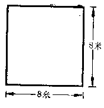
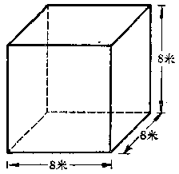

有理数的乘方
------------

----

我们来看下面的问题：

[ **问题** ] 一块正方形的地的一边长8米，它的面积是多少平方米？

[ **解** ] 可以用乘法计算：

: $8\times8=64$.

  

  

[ **问题** ] 一个正方体的每一条棱长是8米，它的体积是多少立方米？

[ **解** ] 也可以用乘法计算：

$8\times8\times8=512$.

上面两个问题里的乘法都是相同因数的乘法.为了简便起见，我们把$8\times8$用$8^{2}$来表示$8\times8\times8$用$8^{3}$来表示.

这就是说：相同因数的乘法，我们可以只写出一个因数，而在这个因数的右上角写上相同因数的个数.

同样地，

$3\times 3\times 3\times 3$

可以用$3^{4}$表示；

$(-1)\times(-1)\times(-1)\times(-1)\times(-1)$

可以用$(-1)^{4}$来表示.

一般地，如果用字母a表示有理数，用字母n表示在乘法中相同因数的个数，那末，这n个因数a相乘就可用$a^{n}$来表示.

这种求相同因数的积的运算叫做**乘方**.乘方的结果叫做**幂**.在$a^{n}$中，a叫做**底数**，n叫做**指数**，$a^{n}$读作a的n次方.把$a^{n}$看作a的次方的结果时，也可以读作a的n次幂.

例如$8^{2}$读做8的二次方或者8的二次幂，也叫做8的平方；$8^{3}$读做8的三次方或者8的三次幂，也叫做8的立方；$3^{4}$读做3的四次方或者3的四次幂，$(-1)^{5}$读做-1的五次方或者-1的五次幂.这里8，3，-1等是底数，而右上角的2，3，4，5等分别是指数.

<h5>备注</h5>
一个数也可以当做这个数的一次幂或一次方，例如5可以看做$5^{1}$而这个指数1字是省略不写的.

乘方就是相同因数的乘法，所以有理数的乘方，就只要依照有理数的乘法法则进行计算.

----

[ **例** ] 计算：$(-2)^{2}$；$(-2)^{3}$；$(-1){}^{4}$；$(-1)^{5}$.

[ **解** ] 

: $(-2)^{2}=(-2)\times(-2)=+4$；  
  $(-2)^{3}=(-2)\times(-2)\times(-2)=-8$；  
  $(-1)^{4}=(-1)\times(-1)\times(-1)\times(-1)=+1$；  
  $(-1)^{5}=(-1)\times(-1)\times(-1)\times(-1)\times(-1)=-1$.

在这个例子里，可以看到：底数是负数时，它的偶次幂是正数，奇次幂是负数.这样，我们就得到

<h5>乘方的运算法则</h5>
<ol>
<li>
正数的任何次幂都是正数；
</li>
<li>
负数的偶数次幂是正数，负数的奇数次幂是负数；
</li>
<li>
幂的绝对值，就是底数的绝对值按指数的次数实际进行乘法运算的结果.
</li>
</ol>

----

[ **例** ] 读出下列各式子，并说明这个幂里面的底数和指数：

: $(-3)^{2}$； $\Big(\cfrac{2}{3}\Big)^{3}$； $(-1)^{4}$； $(-0.3)^{5}$.

[ **解** ]

: $(-3)^{2}$：读做“负三的平方”或“负三的二次幂”，底数是-3，指数是2；  

: $\Big(\cfrac{2}{3}\Big)^{3}$：读做“三分之二的立方”或“三分之二的三次幂”，底数是$\cfrac{2}{3}$，指数是3；  
: $(-1)^{4}$：读做负一的四次方或四次幂，底数是-1，指数是4；  

: $(-0.3)^{5}$：读做负零点三的五次方或五次幂，底数是-0.3，指数是5.

----

[ **例** ] 计算：

: (1)  $3^{5}$；

  (2)  $2^{4}$；

  (3)  $(-1)^{2}$；

  (4)  $(-2)^{3}$；

  (5)  $(-3)^{2}$；

  (6)  $(-1)^{100}$；

  (7)  $(0.1)^{2}$；

  (8)  $(-0.1)^{2}$；

  (9)  $\Big(-\cfrac{2}{3}\Big)^{2}$；

  (10) $\Big(-\cfrac{3}{4}\Big)^{3}$.

[ **解** ] 

: (1)  $3^{5}=243$；

  (2)  $2^{4}=16$；

  (3)  $(-1)^{2}=+1$；

  (4)  $(-2)^{3}=-8$；

  (5)  $(-3)^{2}=+9$；

  (6)  $(-1)^{100}=+1$；

  (7)  $(0.1)^{2}=0.01$；

  (8)  $(-0.1)^{2}=+0.01$；

  (9)  $\Big(-\cfrac{2}{3}\Big)^{2}=+\cfrac{4}{9}$；

  (10) $\Big(-\cfrac{3}{4}\Big)^{3}=-\cfrac{27}{64}$.

----

[ **例** ] 计算：(1) $2^{3}$； (2) $3^{2}$； (3) $2\times3$；并说明它们的区别.

[ **解** ] (1)$2^{3}=8$； (2) $3^{2}=9$； (3) $2\times3=6$.  

: $2^{3}$是2的立方，就是$2\text{{\times}}2\times2$；$3^{2}$是3的平方，就是$3\times 3$；$2\times 3$是两个不同的因数2与3的积，这三个式子是不相同的.

----

[ **例** ] 说明下面两个式子的区别并分别计算出结果来：

: $(-3)^{2}$；$-3^{2}$.

[ **解** ] 

: $(-3)^{2}$等于$(-3)\times(-3)$，表示负三的平方，读做“负三的平方”，  

  $-3{}^{2}$等于$-(3\times3)$，表示三的平方的相反数，读做“负的三平方”，  

<h5>习题</h5>

1.  把下列各个式子读出来，说明它的底数和指数，用乘法式子来表示它，并算出结果：

    (1)  $5^{3}$；

    (2)  $(-2)^{6}$；

    (3)  $\Big(\cfrac{1}{3}\Big)^{3}$；

    (4)  $\Big(-\cfrac{3}{4}\Big)^{4}$.

2.  计算：

    (1)  $3^{4}$；

    (2)  $2^{5}$；

    (3)  $(-3)^{4}$；

    (4)  $(-2)^{5}$；

    (5)  $0^{3}$；

    (6)  $(-1)^{2}$；

    (7)  $(-1)^{3}$；

    (8)  $(-5)^{4}$.

3.  计算：

    (1)  $\Big(\cfrac{1}{3}\Big)^{4}$；

    (2)  $\Big(\cfrac{1}{2}\Big)^{5}$；

    (3)  $\Big(-\cfrac{1}{2}\Big)^{5}$；

    (4)  $\Big(-\cfrac{1}{3}\Big)^{4}$；

    (5)  $\Big(-\cfrac{3}{2}\Big)^{6}$；

    (6)  $\Big(-\cfrac{5}{7}\Big)^{2}$；

    (7)  $\Big(-\cfrac{11}{12}\Big)^{2}$；

    (8)  $\Big(-\cfrac{5}{9}\Big)^{3}$.

4.  计算：

    (1)  $(0.1)^{2}$；

    (2)  $(-0.1)^{2}$；

    (3)  $(-0.1)^{3}$；

    (4)  $(0.02)^{4}$；

    (5)  $(-0.3)^{3}$；

    (6)  $\Big(-0.7\Big)^{2}$；

    (7)  $(0.03)^{3}$

    (8)  $(-1.2)^{3}$.

5.  计算：

    (1)  $(-1)^{200}$；

    (2)  $(-1)^{127}$；

    (3)  $(-1)^{1016}$；

    (4)  $(-1)^{3033}$.

6.  计算：

    (1)  $(-5)^{2}$；

    (2)  $-5^{2}$；

    (3)  $-1^{400}$；

    (4)  $(-1)^{400}$；

    (5)  $\Big(-\cfrac{1}{2}\Big)^{5}$；

    (6)  $-\Big(\cfrac{1}{2}\Big)^{5}$；

    (7)  $\Big(-\cfrac{2}{3}\Big)^{4}$；

    (8)  $-\Big(\cfrac{2}{3}\Big)^{4}$.

