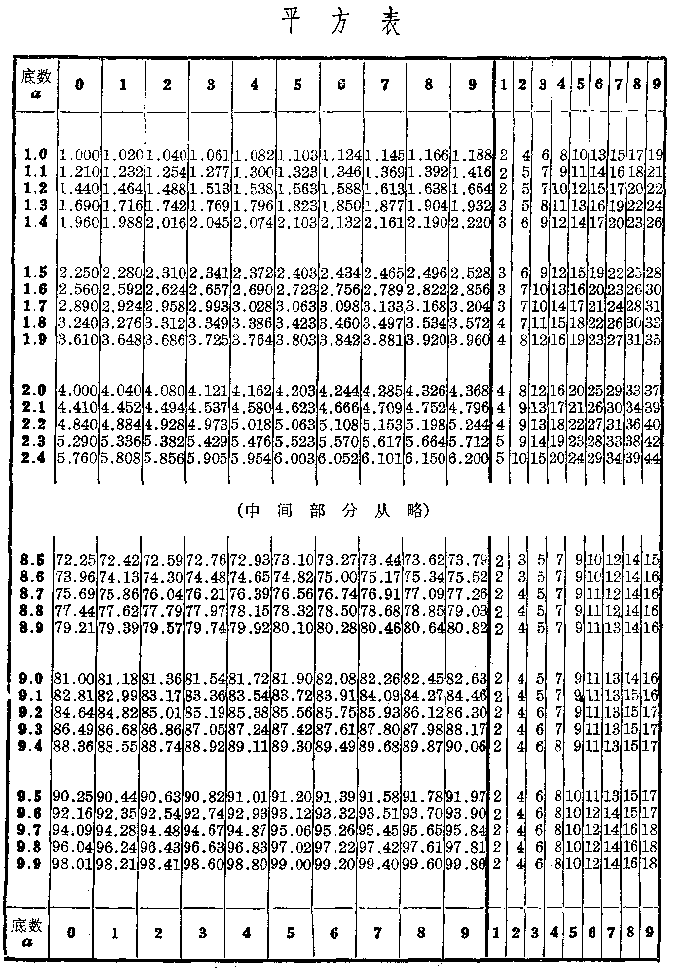

平方表
------

----

在实际应用中，我们有时需要计算数字位数较多的数的平方或立方，这些计算比较烦琐，而实际需要的又往往只是它们的近似值.在前面我们已经复习过四舍五入法求近似值的法则了，现在再来学习一个近似数的有效数字的位数的概念.

在把3.04695这个小数用四有理数的减法舍五入法得到3.03的时候，我们说这个近似数有两位小数，或者说这个近似数是精确到0.01的.

如果把这个数乘上100，得304.695，用四舍五入法求精确到1的近似值，得到近似数305.如果把304.695再乘上100，用四舍五入法求精确到100的近似值，得到近似数305，而这个近似数是以100为单位计数的.

这三个近似数，实际上都包含数字305，我们就把它叫做有效数字，这三个近似数含有相同的有效数字，但是精确到的数位不同.

**有效数字** 一个近似数从左边第一个不是零的数字起到右边最后一位四舍五入所得到的数字止，一共包含的数字的个数叫做这个近似数的有效数字的位数.其中任意一位上的数字都是有效数字.

现在把3.04695四舍五入所得的近似数和它们的有效数字的位数说明如下：

|3.05   | 有三位有效数字.
|3.047  | 有四位有效数字.
|3.0470 | 有五位有效数字

应该注意：如果一个近似数左边第一位是零，这个零就不作为有效数字.例如把小数0.0036754四舍五入得到近似数：

0.0037，只有两位有效数字.

0.00368，只有三位有效数字.

在介绍平方表之前，我们还要熟悉下面的关系：

(1) 如果一个数扩大10倍，它的平方数就扩大100倍，如果这个数扩大100倍，它的平方数就扩大10000倍.

$\begin{array}{cccl}
\text{例如} & 6^{2}=36， & \text{而{(6\times10)^{2}}} & =6\times10\times6\times10  
 &  &  & =6^{2}\times100=3600.
\end{array}$

$(6\times100)^{2}=6\times100\times6\times100=6^{2}\times10000=360000$.

(2) 如果一个数缩小$10$倍，它的平方数就缩小$100$倍，如果这个数缩小$100$倍，它的平方数就缩小$10000$倍.

例如$6^{2}=36$，而

$(6\times \cfrac{1}{10} )^{2}=6\times\cfrac{1}{10}\times 6\times \cfrac{1}{10}$

$=36\times \cfrac{1}{100}=0.36$.

$\Big(6\times\cfrac{1}{100}\Big)^{2}=6\times\cfrac{1}{100}\times6\times\cfrac{1}{100}=36\times\cfrac{1}{10000}=0.0036$.

下表是1.000到9.999的平方(有四位有效数字的近似数)表的一部分(头和尾).从这个表上可以查出其中有四位有效数宇的数的平方的结果(有四位有效数字).

----

[ **例** ] 求$(1.436)^{2}$.

[ **查表** ]

: (1) 先从左边“底数a”的直列里查含有开始两位数字1.4的那一横行；  

  (2) 再从上边“底数a”的横行里查含有第三位数字3的那一直列；  

  (3) 从含有1.4的横行和含有3的直列的交叉处查得2.045，就是$(1.43)^{2}\approx2.045$；  
  
  (4) 再从右侧首行“1~9”那些数字里查到第四位数6，并查出这一直列与含有1.4的那一横行的交叉处，得17，这个17应是0.017，表中是简略的写法，这一部分叫做修正值，要加在刚才得到的数2.045上；  

  (5)求和.得2.045+0.017=2.062.

[ **解** ] $(1.436)^{2}\approx2.062$

----

[ **例** ] 求$(14.36)^{2}$.

[ **查表** ]

: (1) 查表的方法同例1，得2.062$.  

  (2) 因为$14.36=1.436\times10$，所以

      $(14.36)^{2}=2.062\times100=206.2$.

[ **解** ] $(14.36)^{2}=206.2$.

----

[ **例** ] 求$(1436)^{2}$和$(0.01436)^{2}$.

[ **审题** ] $\because\quad 1436=1.436\times 1000$，  

$\therefore\quad (1436)^{2}=(1.436)^{2}\times 1000^{2}$.  

$\because\quad 0.01436=1.436\times \cfrac{1}{100}$，  

$\therefore\quad (0.01436)^{2}=(1.436)^{2}\times \cfrac{1}{100^{2}}$.

[ **解** ] $(1486)^{2}\approx2062000$.  

$(0.01436)^{2}\approx0.0002062$.

这里我们再加几点说明：

1. 查表所得的平方数绝大部分并非准确值而是近似值，为了避免近似符号的写法麻烦，也可以写等号.

2. 立方表和立方表的查法与平方表类似.不过，当底数扩大或缩小$10$倍时，立方数要相应地扩大或缩小1000倍.即每当底数的小数点向左或向右移一位时，立方数的小数点要相应地向左或向右移三位.

3. 如果底数的数字位数少于四个时，平方数可以在表上查得；如果底数的数字位数多于四个时，要先把底数用四舍五入法化成相应的四位数(近似数)，再行查表.

从查平方表的过程中可以了解，不但小数有近似数，整数也有近似数.为了要说明一个近似数的有效数字的位数，我们把有四位有效数字的数2062000写做$2.062\times10^{6}$.同样地，从表上查得$(2490)^{2}\approx6200000$就应该写做$6.200\times 10^{6}$.这里，6.200的两个0都不能省略.

这种记数法叫做科学记数法.

<h5>习题</h5>

1.  查平方表求下列各平方数的近拟值：

    (1)  $(1.953)^{2}$；

    (2)  $(2.484)^{2}$；

    (3)  $(9.57)^{2}$；

    (4)  $(14.73)^{2}$；

    (5)  $(2093)^{2}$；

    (6)  $(0.9034)^{2}$；

    (7)  $(0.0228)^{2}$；

    (8)  $(-13.45)^{2}$；

    (9)  $(-0.01111)^{2}$；

    (10) $(-0.1835)^{2}$.

2.  回答下列问题及其可能情况：

    (1)  大于1而小于10的数的平方有几位整数？

    (2)  大于1而小于10的数的立方有几位整数？

    (3)  大于10而小于100的数的平方有几位整数？

    (4)  大于10而小于100的数的立方有几位整数？

    (5)  有五位整数的数的平方有几位整数？立方呢？

3.  小于$1而大于0.1的数的平方紧接小数点后面有没有0？有几种可能？立方呢？

4.  小于0.1而大于0.01的数的平方紧接小数点后面有几位0？立方呢？

5.  绝对值大于1的数的平方或立方的绝对值会小于1吗？绝对值小于1的数的平方或立方的绝对值会大于1吗？

6.  下列各近似数有几位有效数字？
    
    3.64，0.0332，364.0，5.7，5.700.

7.  把下列各数用四舍五入法写做三位有效数字的近似值.
    
    0.3647，0.02585，35473，56.948，32.449，5.696.

8.  如果下列各数都是4位有效数字的近似数，用科学记数法表示下列各数：
    
    35470，35.79，23000.

