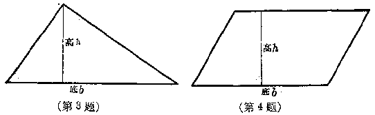
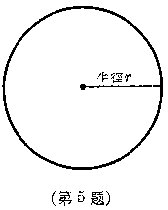

代数式
======

在上一章里我们学习了关于有理数的知识.从算术里的数扩大到有理数，这是从算术到代数的一个重要的发展，现在，我们还要学习从算术到代数的另一个重要的发展－－用字母表示数，从而引进代数式.

代数式
------

### 用字母表示数

我们曾经在有理数这一章里学到过加法交换律.就是：在加法里，两个加数的前后位置可以互相对调，它们的和相等.

但是，这句话写起来比较长，领会起来有时也不太容易.可不可以用比较简单明确的方法来叙述呢？

如果我们用两个字母a和b来表示这两个加数，那末，加法交换律就可以用

a+b=b+a

来表示，它就很简单，而且很明确.我们在上一章里已经这样用过了.

在算术里我们知道，做两个真分数或假分数的乘法只要把分子分母分别相乘，如果我们用字母a和b分别表示一个分数的分子和分母，字母c和d分别表示另一个分数的分于和分母，这个运算法则就可以简单明确地表示成

$\cfrac{a}{b}\times\cfrac{c}{d}=\cfrac{a\times c}{b\times d}$.

用同样的方法，我们可以把分数的除法法则表示成

$\cfrac{a}{b}\div\cfrac{c}{d}=\cfrac{a}{b}\times\cfrac{d}{c}$.

在生产、学习、生活和科学研究上，我们会碰到许多计算的公式，用字母来表示有关的数，就可以使这些公式大大简化.例如，在算术里：我们学过矩形(长方形)的面积计算公式是：${面积}={长}\times{宽}$；正方形的面积计算公式是：${面积}={边长}\times{边长}$.如果我们用字母S表示矩形或正方形的面积，字母b和h表示矩形的长和宽，a表示正方形的边长，那末，

矩形的面积公式为

$S=b\times h$.

正方形的面积公式为

$S=a\times a=a^{2}$.

这样就很简单明确.

### 代数式

用字母表示数之后，我们就会得到包含字母的一些计算式子，象a+b，$\cfrac{1}{2}\times a\times b$，$\cfrac{a\times c}{b\times d}$，$a^{2}$，$(a+b)\times c$，$\pi\times r^{2}$等.我们把这类式子叫做**代数式**.代数式的共同特点是，它们都包含表示数的数字或字母，同时还常常包含运算的符号，所以我们说：

_用有限次的加、减、乘、除、乘方等运算符号把数字、字母连接起来的式子叫做代数式._

_用数字或者字母表示的一个单独的数，也可以看作是代数式._

例如：3，-5，x，1，0等也可以看作是代数式.

在算术里，乘号总是用“$\times$”来表示的，在代数里，我们仍旧使用这个乘号“$\times$”.但有时，如果两个有理数用括号括起来之后再相乘，或者一个数乘以一个用字母表示的数，或者两个用字母表示的数相乘，我们可以把乘号写做或者就把乘号省略掉.

例如：

$(-3)\times(-5)$可以写做$(-3)\cdot(-5)$或者(-3)(-5)；

$3\times a$可以写做$3\cdot a$或者$3a$；

$a\times b$可以写做$a\cdot b$或者$ab$.

<h5>习题</h5>

1.  用字母来表示有理数的减法法则：从一个数减去另一个数，等于这个数加上另一个数的相反的数.

    [提示：以字母表示一个数，用字母表示另一个数，那末另一个数的相反的数就可以用$-b$来表示.]

2.  用字母来表示分数的基本性质：一个分数的分子分母同乘以一个不是零的数，分数的值不变.

    [提示：把分数的分子分母分别用字母$a$和$b$来表示，一个不是零的数用$m$来表示，并注明$m\neq0$.]

3.  一个三角形的面积等于它的底边与高的乘积的二分之一.如果用字母S表示三角形的面积，b表示它的底边，h表示它的高，试用s，b，h写出三角形的面积公式.

    

4.  一个平行四边形的面积等于它的底边与高的乘积.用字母S表示面积，b表示底边，h表示高，试用S，b，h写出平行四边形的面积公式.

5.  一个圆的周长等于它的半径乘以圆周率的2倍.如果用字母C表示圆的周长，r表示半径，用希腊字母$\pi$表示圆周率，写出圆的周长的公式.

    

6.  一个圆的面积等于它的半径的平方乘以圆周率.如果用字母S表示圆的面积，r表示半径，用希腊字母$\pi$表示圆周率，写出圆的面积公式.

7.  一列火车行驶的路程等于它的平均速度乘上行驶的时间.如果用字母s表示它行驶的路程，v表示它的平均速度，t表示它行驶的时间，写出火车行驶路程的公式.

