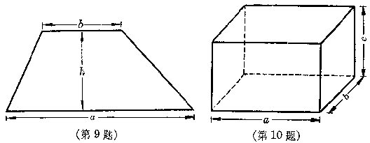

代数式的值
----------

代数式是表示数的计算式子.如果代数式里的字母用指定的数去代替，再依照代数式里所表示的运算进行计算，所得的结果就叫做**代数式的值**.

***

[ **例** ] 计算代数式$-3a^{2}b$的值：  

(1) 当a=-3，b=5；  

(2) 当a=0.1，b=8；  

(3) 当$a=\cfrac{3}{5}$，$a=-8\cfrac{1}{3}$.

[ **解** ] 

(1) $-3a^{2}b=-3(-3)^{2}(5)=-3\cdot(+9)\cdot5=-135$；  

(2) $-3a^{2}b=-3(0.1)^{2}(8)=-3(0.01)(8)=0.24$；  

(3) $-3a^{2}b=-3\Big(\cfrac{3}{5}\Big)^{2}\Big(-8\cfrac{1}{3}\Big)=-3\cdot\cfrac{9}{25}\cdot\Big(-\cfrac{25}{3}\Big)=+9$.

***

[ **例** ] 计算代数式化$2x^{3}-5x^{2}+3x-8$的值：

1.  当x=1；

2.  当$x=-\cfrac{1}{2}$.

[ **解** ] 

(1) $2x^{3}-5x^{3}+3x-8$

$=2(1)^{3}-5(1)^{2}+3(1)-8$  

=2-5+3-8=-8；  

(2) $2x^{3}-5x^{3}+3x-8$  

$=2\Big(-\cfrac{1}{2}\Big)^{3}-5\Big(-\cfrac{1}{2}\Big)^{2}+3\Big(-\cfrac{1}{2}\Big)-8$  

$=2\Big(-\cfrac{1}{8}\Big)-5\Big(+\cfrac{1}{4}\Big)+3\Big(-\cfrac{1}{2}\Big)-8$  

$=-\cfrac{1}{4}-\cfrac{5}{4}-\cfrac{3}{2}-8=-\cfrac{3}{2}-\cfrac{3}{2}-8=11$.

[ **注意** ]

把字母的指定数值代入代数式后，有些乘方或原来省略乘号的地方，需要添上括号或者乘号.

***

[ **例** ] 计算代数式$3(3a-2b)^{2}$的值：  

(1) 当a=-2，b=+3；  

(2) 当a=-0.4，b=-0.3.

[ **解** ] 

(1) $3(3a-2b)^{2}$

$=3[3(-2)-2(+3)]^{2}$

$=3(-6-6)^{2}=3(-12)^{2}$

=3(+144)=432；

(2) $3(3a-2b)^{2}$

$=3[3(-0.4)-2(-0.3)^{2}]$

$=3(-1.2+0.6)^{2}=3(-0.6)^{2}$

$=3\times0.36=1.08$.

***

[ **例** ] 计算代数式$\cfrac{a+2b}{2a+b}$的值：  

(1) $a=-1\cfrac{1}{2}$，$b=1\cfrac{2}{3}$；  

(2) a=-1.3，b=-1.5.

[ **解** ] 

(1) $\cfrac{a+2b}{2a+b}=\cfrac{-1\cfrac{1}{2}+2\Big(1\cfrac{2}{3}\Big)}{2\Big(-1\cfrac{1}{2}\Big)+\Big(1\cfrac{2}{3}\Big)}=\cfrac{-\cfrac{3}{2}+\cfrac{10}{3}}{-3+\cfrac{5}{3}}$  

$=\cfrac{-9+20}{-18+10}=\cfrac{11}{-8}=-1\cfrac{3}{8}$；  

(2) $\cfrac{a+2b}{2a+b}=\cfrac{-1.3+2(-1.5)}{2(-1.3)+(-1.5)}=\cfrac{-1.3-3}{-2.6-1.5}$  

$=\cfrac{-4.3}{-4.1}=\cfrac{43}{41}=1\cfrac{2}{41}$.

***

[ **例** ] 计算代数式$-a^{2}$与$(-a)^{2}$的值：

1.  a=5；

2.  a=-5；

3.  a=0.13；

4.  a=0.13.

[ **审题** ] $-a^{2}$要先平方再添上负号，$(-a)^{2}$要先添上括号再平方.

[ **解** ] 

(1) $-a^{2}=-5^{2}=-25$，  

$(-a)^{2}=(-5)^{2}=+25$；  

(2) $-a^{2}=-(-5)^{2}=-25$，  

$(-a)^{2}=[-(-5)]^{2}=5^{2}=25$；  

(3) $-a^{2}=-(0.13)^{2}=-0.0169$，  

$(-a)^{2}=(-0.13)^{2}=+0.0169$；  

(4) $-a^{2}=-(-0.13)^{2}=+0.0169$，  

$(-a)^{2}=[-(-0.13)]^{2}=(0.13)^{2}=0.0169$.

<h5>习题</h5>

1.  求代数式a-b的值(填下表)：

    | a   | +5 | +5 | -12 | -12 | $+\cfrac{1}{2}$ | $-\cfrac{1}{2}$ | $-1\cfrac{2}{3}$ | +3.54
    | b   | +7 | -7 | -3  | -20 | $+\cfrac{2}{3}$ | $+\cfrac{2}{3}$ | $-3\cfrac{1}{4}$ | -5.09
    | a-b |  |  |  |  |  |  |  |

    计算下列代数式的值(2~7)：

1.  $-\cfrac{2}{3}ab^{2}$，

    (1)  a=-3， b=-2；

    (2)  $a=-2\cfrac{1}{3}$， $b=-1\cfrac{1}{7}$.

2.  $-x^{3}+2x^{2}-3x+4$，

    (1)  x=2；

    (2)  x=-0.3.

3.  $a^{2}-b^{2}$，

    (1)  a=-3， b=-5；

    (2)  a=-5.3， b=4.7.

4.  $(a-b)^{2}$，

    (1)  a=-3， b=-5；

    (2)  $a=-3\cfrac{2}{3}$， $b=5\cfrac{1}{2}$.

5.  $\cfrac{(a+b)^{2}}{a^{2}+b^{2}}$

    (1)  a=-2， b=-3；

    (2)  a=0.3， b=-0.4.

6.  $\cfrac{1+a+a^{2}}{1-a+a^{2}}$，

    (1)  a=-5；

    (2)  $a=+3\cfrac{1}{3}$.

7.  求下表空格内有关代数式的值：\

    | a       | 5 | -5 | $\cfrac{2}{3}$ | $-\cfrac{2}{3}$ | 0 | $-5\cfrac{1}{3}$
    | -a      |  |  |  |  |  |
    | \|a\|   |  |  |  |  |  |
    | \|-a\|  |  |  |  |  |  |
    | -\|-a\| |  |  |  |  |  |
    
8.  梯形的而积公式是$S=\cfrac{(a+b)h}{2}$，这里S表示梯形的面积，a和b表示梯形的两底，表示梯形的高；底和高的单位如果是厘米，那末面积的单位是平方厘米.从下列各已知量，求梯形的面积S：

    (1)  a=15厘米，b=3厘米，h=3厘米；

    (2)  a=2.4厘米，b=1.2厘米，h=0.9厘米.

    [解法举例：(1) $S=\cfrac{(a+b)h}{2}=\cfrac{(15+7)\times3}{2}=33{(平方厘米)}$.]
    
    

9.  长方体的表面积公式是S=2(ab+ac+bc)，这里S表示长方体的表面积，a，b，c分别表示它的长、宽和高.从下列各已知量，求长方体的表面积：

    (1)  a=5厘米，b=7厘米，c=9厘米；

    (2)  a=0.3厘米，b=0.2厘米，c=0.4厘米.

